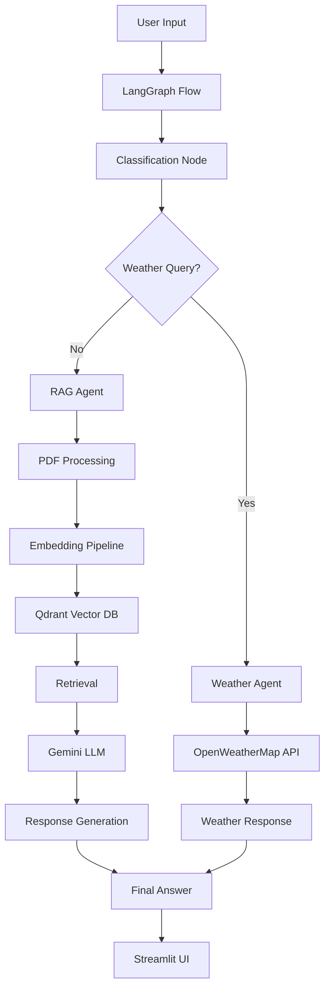
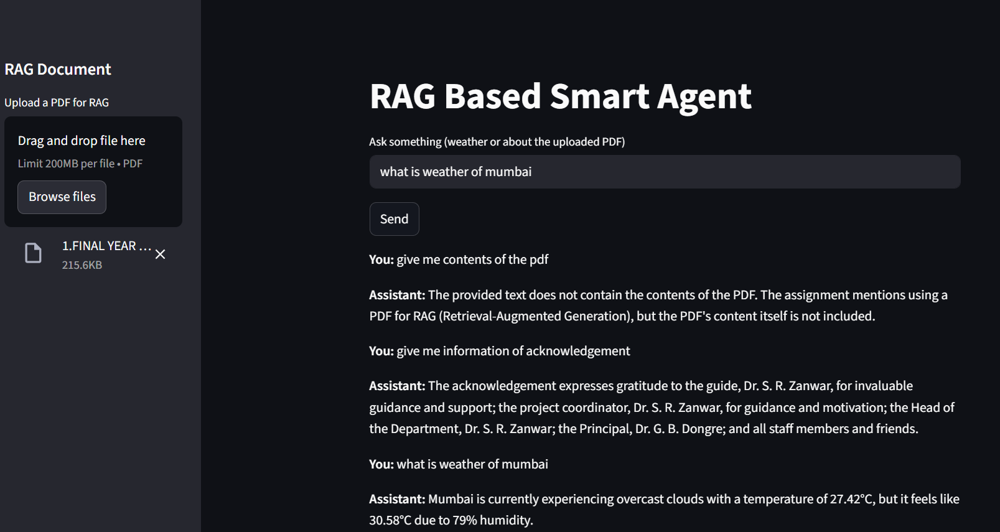
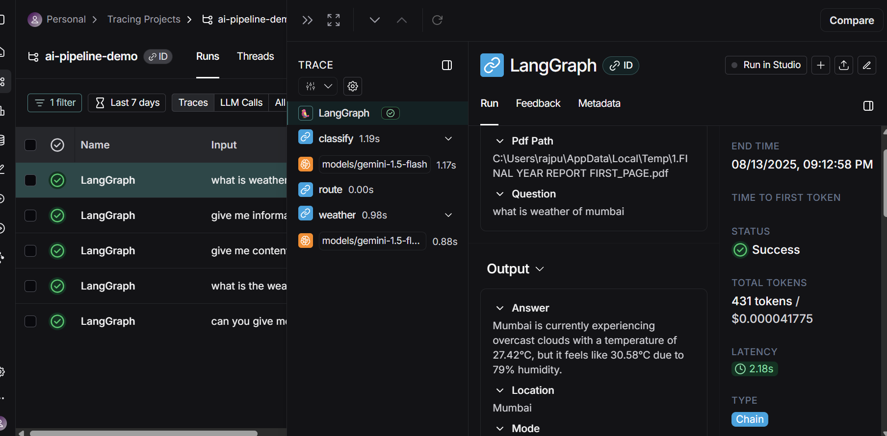
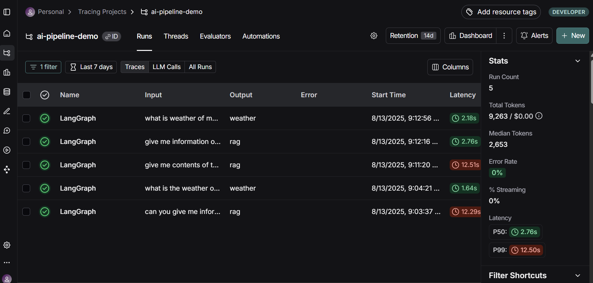

# 🤖 AI Pipeline Project - Smart RAG & Weather Agent

<div align="center">


**An intelligent AI pipeline that combines Retrieval-Augmented Generation (RAG) with real-time weather data using LangGraph and LangChain**

[🚀 Quick Start](#-quick-start) • [📖 Features](#-features) • [🏗️ Architecture](#️-architecture) • [🔧 Setup](#-setup) • [📊 Demo](#-demo) • [🤝 Contributing](#-contributing)

</div>

---

## 🎯 Project Overview

This AI pipeline project demonstrates a sophisticated multi-agent system that intelligently routes user queries between two specialized agents:

- **🌤️ Weather Agent**: Provides real-time weather information for any city
- **📚 RAG Agent**: Answers questions from uploaded PDF documents using advanced retrieval and generation

The system uses **LangGraph** for orchestration, **LangChain** for LLM integration, and **Qdrant** for vector storage, creating a seamless conversational AI experience.

## ✨ Key Features

### 🤖 Intelligent Query Routing
- **Automatic Classification**: Uses LLM to determine if a query is weather-related or document-related
- **Smart Location Extraction**: Automatically extracts city names from natural language queries
- **Fallback Handling**: Graceful error handling and user feedback

### 🌤️ Weather Intelligence
- **Real-time Data**: Live weather information from OpenWeatherMap API
- **Multi-location Support**: Query weather for any city worldwide
- **Rich Context**: Temperature, humidity, feels-like temperature, and weather descriptions

### 📚 Advanced RAG System
- **PDF Processing**: Automatic text extraction and chunking
- **Vector Embeddings**: Uses sentence-transformers for semantic search
- **Context-Aware Answers**: Generates responses based on retrieved document passages
- **Source Attribution**: Provides references to source documents

### 🏗️ Modern Architecture
- **LangGraph Flow**: State-based workflow orchestration
- **Modular Design**: Clean separation of concerns with dedicated agents
- **Streamlit UI**: Beautiful, interactive web interface
- **Evaluation Metrics**: Built-in response quality assessment

## 🏗️ Architecture



### 📁 Project Structure

```
ai_pipeline_project/
├── 📁 src/
│   ├── 🤖 agents/
│   │   ├── decision_agent.py      # Query classification logic
│   │   ├── rag_agent.py          # RAG pipeline implementation
│   │   └── weather_agent.py      # Weather API integration
│   ├── 🏗️ graph/
│   │   └── flow.py               # LangGraph workflow definition
│   ├── 🔄 pipelines/
│   │   ├── embedding_pipeline.py # Vector embedding processing
│   │   └── retrieval.py          # Document retrieval logic
│   ├── 🛠️ utils/
│   │   ├── evaluation.py         # Response quality metrics
│   │   ├── llm.py               # LLM configuration
│   │   ├── pdf_loader.py        # PDF text extraction
│   │   └── qdrant_helper.py     # Vector database operations
│   └── 🖥️ app.py                # Streamlit web application
├── 📁 config/
│   └── settings.py              # Environment configuration
├── 📁 data/
│   ├── embeddings/              # Vector embeddings storage
│   └── pdfs/                    # Sample PDF documents
├── 📁 evaluation/
│   ├── test_rag.py             # RAG system testing
│   └── test_weather.py         # Weather agent testing
└── 📁 tests/
    └── test_end_to_end.py      # End-to-end integration tests
```

# demo of project :


1.Langraph result:




## 🚀 Quick Start

### Prerequisites

- Python 3.8+
- Qdrant vector database
- API keys for Gemini and OpenWeatherMap

### 1. Clone and Setup

```bash
git clone https://github.com/Swarajsolanke/Smart-Rag-Based-Pipeline-agent.git
cd Smart-Rag-Based-Pipeline
pip install -r requirements.txt
```

### 2. Environment Configuration

Create a `.env` file in the project root:

```env
# LLM Configuration
GEMINI_API_KEY=your_gemini_api_key_here
GEMINI_MODEL=gemini-1.5-flash

# Weather API
WEATHER_API_KEY=your_openweathermap_api_key_here

# Vector Database
QDRANT_URL=http://localhost:6333
QDRANT_API_KEY=your_qdrant_api_key_here
QDRANT_COLLECTION=ai_pipeline_collection

# Embeddings
EMBEDDING_MODEL=all-MiniLM-L6-v2

# LangSmith (optional)
LANGCHAIN_TRACING_V2=false
LANGCHAIN_API_KEY=your_langsmith_api_key_here
LANGCHAIN_PROJECT=ai-pipeline-demo
```

### 3. Start Qdrant

```bash
# Using Docker
docker run -p 6333:6333 qdrant/qdrant

# Or download from https://qdrant.tech/documentation/quick-start/
```

### 4. Launch the Application

```bash
streamlit run src/app.py
```

Visit `http://localhost:8501` to access the web interface!

## 📊 Demo

### Weather Queries
```
User: "What's the weather in Mumbai?"
Assistant: "Weather in Mumbai: scattered clouds. Temp: 28°C (feels like 32°C). Humidity: 78%."

User: "How's the temperature in New York?"
Assistant: "Weather in New York: clear sky. Temp: 15°C (feels like 13°C). Humidity: 45%."
```

### RAG Queries
```
User: "What are the main findings in section 3?"
Assistant: "Based on the document, section 3 discusses the implementation of AI-driven 
decision making systems. The main findings include improved accuracy by 23% and 
reduced processing time by 40% compared to traditional methods..."

User: "Explain the methodology used in this research"
Assistant: "The research methodology involves a multi-stage approach combining 
machine learning algorithms with traditional statistical analysis..."
```

## 🔧 Advanced Configuration

### Custom Embedding Models

You can change the embedding model in `config/settings.py`:

```python
EMBEDDING_MODEL = "all-mpnet-base-v2"  # Higher quality, slower
# or
EMBEDDING_MODEL = "all-MiniLM-L6-v2"   # Faster, good quality
```

### LangSmith Integration

Enable tracing and monitoring:

```env
LANGCHAIN_TRACING_V2=true
LANGCHAIN_API_KEY=your_langsmith_key
LANGCHAIN_PROJECT=ai-pipeline-demo
```

### Custom LLM Models

Switch between different Gemini models:

```env
GEMINI_MODEL=gemini-1.5-pro    # More capable
GEMINI_MODEL=gemini-1.5-flash  # Faster, cost-effective
```

## 🧪 Testing

Run the test suite to ensure everything works correctly:

```bash
# Run all tests
pytest tests/

# Test specific components
pytest evaluation/test_rag.py
pytest evaluation/test_weather.py
pytest tests/test_end_to_end.py
```

## 📈 Performance & Evaluation

The system includes built-in evaluation metrics:

- **Retrieval Accuracy**: Measures relevance of retrieved documents
- **Response Quality**: Assesses answer completeness and coherence
- **Response Time**: Tracks system performance
- **User Satisfaction**: Qualitative feedback collection

## 🤝 Contributing

We welcome contributions! Here's how you can help:

### 🐛 Reporting Issues
- Use the GitHub issue tracker
- Include detailed error messages and steps to reproduce
- Specify your environment (OS, Python version, etc.)

### 💡 Feature Requests
- Describe the feature and its use case
- Consider implementation complexity
- Check if it aligns with project goals

### 🔧 Code Contributions
1. Fork the repository
2. Create a feature branch: `git checkout -b feature/amazing-feature`
3. Make your changes and add tests
4. Commit with clear messages: `git commit -m 'Add amazing feature'`
5. Push to your branch: `git push origin feature/amazing-feature`
6. Open a Pull Request

### 📝 Development Guidelines
- Follow PEP 8 style guidelines
- Add docstrings to all functions
- Include type hints where possible
- Write tests for new functionality
- Update documentation as needed

## 📚 API Reference

### Core Functions

#### `decide_action(user_message: str) -> Dict[str, str]`
Classifies user input as weather or RAG query.

#### `fetch_weather_by_city(city: str) -> Dict[str, Any]`
Retrieves weather data for a given city.

#### `answer_from_docs(pdf_path: str, question: str) -> Dict[str, Any]`
Generates answers from PDF documents using RAG.

### Configuration

#### Environment Variables
- `GEMINI_API_KEY`: Google Gemini API key
- `WEATHER_API_KEY`: OpenWeatherMap API key
- `QDRANT_URL`: Qdrant vector database URL
- `EMBEDDING_MODEL`: Sentence transformer model name

## 🛠️ Troubleshooting

### Common Issues

**Q: "GEMINI_API_KEY not set"**
A: Ensure your `.env` file contains the correct API key and is in the project root.

**Q: "Qdrant connection failed"**
A: Make sure Qdrant is running on the specified URL (default: http://localhost:6333).

**Q: "Weather API errors"**
A: Verify your OpenWeatherMap API key is valid and has sufficient quota.

**Q: "PDF processing fails"**
A: Ensure the PDF is not corrupted and contains extractable text.

### Performance Tips

- Use `gemini-1.5-flash` for faster responses
- Limit PDF size for better processing speed
- Enable LangSmith tracing for debugging
- Use appropriate embedding models for your use case

## 📄 License

This project is licensed under the MIT License - see the [LICENSE](LICENSE) file for details.

## 🙏 Acknowledgments

- **LangChain** team for the excellent framework
- **Qdrant** for the powerful vector database
- **OpenWeatherMap** for weather data
- **Google** for the Gemini LLM API
- **Streamlit** for the beautiful UI framework

---

<div align="center">


[⭐ Star this repo](https://github.com/yourusername/ai-pipeline-project) • [🐛 Report Issues](https://github.com/yourusername/ai-pipeline-project/issues) • [📖 Documentation](https://github.com/yourusername/ai-pipeline-project/wiki)

</div> 
